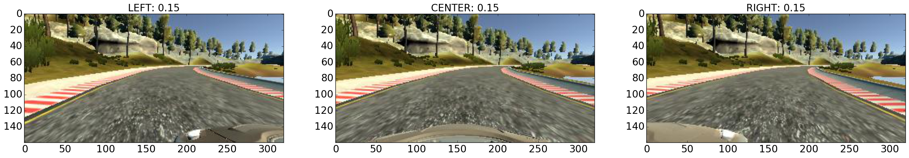
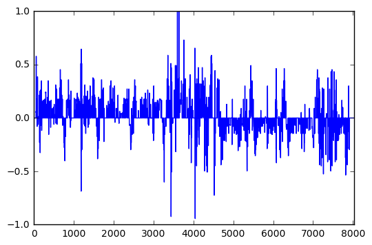
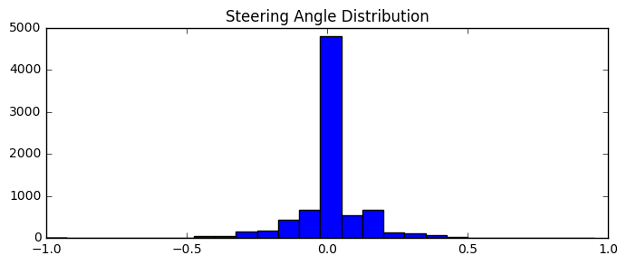
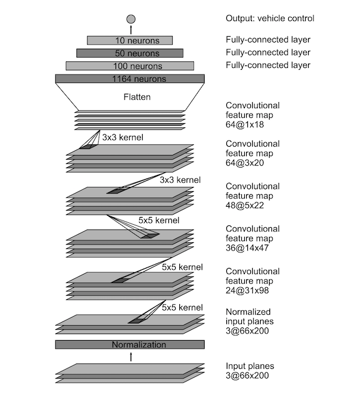
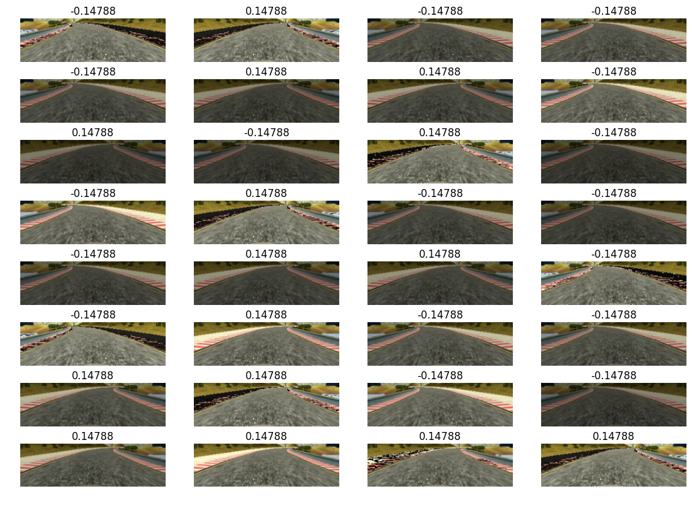
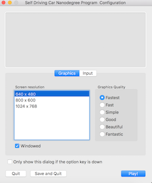
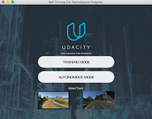

# Behavioral Cloning - Steering Angle Prediction

Author: Annie Flippo

Date: Jan-07-2017

This project is for Udacity Self-Driving Car Nanodegree, Steering Simulator Project 3: Behavioral Cloning.


## The Goal

The goal is to train a neural network, by providing sample images mounted from inside the car and the actual steering angles at that moment, to learn to drive on the training track and a new test track successfully while staying on the road.  

The steps to accomplish this goal include:

1. Use center camera images and steering data as a training data set
2. Select or design a neural network architecture to learn the steering angle based on the center images
3. Train it to drive the car on Track 1 (Training Track)
4. Visually observe if the car stays on the track without crashing, getting hung up on the side of the road or exhibits any behavior that would be dangerous if humans were riding inside
5. Fix problems by either creating more training data or tune parameters to reduce overfitting and re-train model
6. Test the model on a new track that the model has never seen before (e.g. Training track) to ensure a successful  drive on the road


# The Data

I collected my own data using the arrow keys and I noticed the steering angles don't tend to be smooth but makes somewhat of discreet turns.  My generated data was not enough to train the model with around 3,000+ rows in driving_log.csv which mostly well-behaved driving in the middle of the road.  

After reading discussions in the forum, I elected to use the Udacity's data as a starting point since my data didn't have much variety.  Here's an example of three images from left, center and right camera at a point in time:




While doing some exploratory analysis, I noticed most of the data had **steering angle near 0** (e.g. driving straight) and very few samples of left or right steering angles.  See the Steering Angle as a time-serie:

## Steering Angles Time-Series

Notice most of the data hover near the zero horizontal line where the car was mostly driving straight.




## Steering Angle Histogram

Observe the large spike of 0 degree steering angle in the histogram.




To over come this data imbalance problem, I've decided to **up-sample** sharper turning angles (e.g. steering_angle > 0.15 and < -0.15) and to **down-sample** near 0 degree turns.  I've come to this conclusion after having trained the model many iterations and the car only turned a little even during sharp turns on the road. It was also suggested in forum discussions as a good option to try.

Later, the simulations were fine on straight portions of the road but had erratic behavior around corners and on the bridge.  That's when I **collected my own recovery data** as proposed in the project to simulate the car crossing the yellow line or on the red/white strips and drive back to the middle of the road. This turned out to be the best remedy to train the car to drive back to the middle when it starts to drift off to the ledge.

I actually collected my own recovery data several times.  One iteration I had more extreme driving where the car on the ledge or almost off the road and corrected back onto the road.  That recovery data increased erratic behavior for the driving simulation.  Another iteration where I drive towards the yellow line and before I cross it, I correct the car back to the middle.  I've noticed that the more gentle the corrections, the smoother the simulated driving.  

## Generated Data

In addition to generating data from perturbing the steering angle above, I've also used Keras' model.fit_generator( ) function to generate training and validation on-the-fly per [Keras fit_generator( ) document](https://keras.io/models/sequential/).  


## The Architecture

There are many companies that have already started developing automonous-driving cars. I've decided to use some of the known models in this exploratory phase: the [Comma.ai's model](https://github.com/commaai/research/blob/master/train_steering_model.py), the basic model from [Keras' tutorial]( https://gist.github.com/fchollet/0830affa1f7f19fd47b06d4cf89ed44d) and the [NVIDIA's model](https://arxiv.org/pdf/1604.07316v1.pdf).   I didn't have much success with the Comma.ai's or the Keras' model probably not because the models didn't work but most likely due to the lack of good variation of training data.  Instead of vetting all the models, I've concentrated on tuning NVIDIA's model for my dataset.





## Specification:

- Input Layer is 66 x 220 x 3
- Normalization Layer
- Convolutional Layer 1: 5 x 5 Kernel, 2 x 2 stride, valid padding, Output: 3 x 66 x 200
- Convolutional Layer 2: 5 x 5 Kernel, 2 x 2 stride, valid padding, Output: 24 x 31 x 98
- Convolutional Layer 3: 5 x 5 Kernel, 2 x 2 stride, valid padding, Output: 36 x 14 x 47
- Convolutional Layer 4: 5 x 5 Kernel, 3 x 3 stride, valid padding, Output: 48 x 5 x 22
- Convolutional Layer 5: 5 x 5 Kernel, 3 x 3 stride, valid padding, Output: 64 x 3 x 20
- Flatten Layer 1: Output: 64 x 1 x 18
- Fully-Connected Layer 1: Output 1152 neurons
- Fully-Connected Layer 2: Output 100 neurons
- Fully-Connected Layer 3: Output 50 neurons
- Fully-Connected Layer 3: Output 10 neurons
- Final Output: 1

## Training

I've split the data into training/validation sets using sklearn's ```train_test_split( )``` and used the following methods to **avoid overfitting** :

1. Randomly change the brightness of the image
2. Randomly flip the image along the middle vertical axis and flip the sign for the steering_angle to get a new data point as if the car was making the opposite turn.
3. Adding an epsilon change to the steering angle

Most importantly, adding an slight perturbation to the steering angle for each image gave ***multiple appropriate*** steering angles for the same image.  I averaged out acceptable steering angle given a specific image.  Before I added this epsilon change the car was steering erratically around corners and after the epsilon change, the car exhibit less erratic behavior and made smoother turns.

Below is an example of generated data from the above single image source.  Notice the variation of brightness, right and left turns with their associated angle and the cropped image which excluded most of the sky, scenery and the hood of the car.  More importantly see how I can potentially increase my training set in code as needed.




## Hyper-Parameters Tuning

There are many hyper-parameters to tune:

- number of iterations
- number of epochs
- batch size
- Adam optimizer parameters (learning rate, beta\_1, beta\_2, epsilon and decay)

I observed that increasing the epochs does not necessarily reduce loss.  The number of iterations gave the model a variation of randomly sampled data to train with.  Batch size depends on the memory available - the larger the batch size the more memory is needed.  As for the Adam optimizer, the most important parameter seems to be the learning rate.  I've tinkered with the learning rate and decay having read that beta\_1 and beta\_2 should be very close to 1.  

I tried many learning rates (0.0001, 0.0005, 0.00075, 0.0008, 0.001, 0.0015).  For lr=0.0001, the loss did not decrease much through each epoch.  It was not learning fast enough or at all.  When I changed it to lr=0.0015, the loss was bouncing around from high to low to high, it was over-correcting model weights and then minimizing loss.  I've found that the best that worked for my data is lr=0.001 which is the default per [Keras documentation](https://keras.io/optimizers/).    


## Driving Simulation on the Training Track

Check out the [Driving Simulation on Training Track](https://youtu.be/bAQrg0V29G0).  It goes around the track twice.


[](https://youtu.be/bAQrg0V29G0 "Autonomous Driving, Steering Simulaiton, on Training Track")


## Driving Simulation on the Test Track

Here is the [Driving Simulation on the Test Track](https://youtu.be/5pKYD6rqIdQ).  It zips around the track at almost 30 mph most of the time!

[](https://youtu.be/5pKYD6rqIdQ "Autonomous Driving, Steering Simulaiton, on Test Track")

# Training Hardware

I used my MacBook Pro (Retina, Mid 2015), 2.8 GHz Intel Core i7 processor and 16 GB Ram.  

## How to run the simulation

Ensure the following software is installed in your environment:

- Python 3.5
- TensorFlow
- keras
- h5py
- scipy
- numpy
- scikit-learn
- Pillow
- opencv (I've used opencv3)
- matplotlib
- random

To use the model to run the simulation car, run the following on command line on a terminal:

```
% python drive model.json
```

Pick any Screen resolution: 

- 640 x 480
- 800 x 600
- 1024 x 768



Then, select Training Track (on the left) or Test Track (on the right), and click "AUTONOMOUS MODE".  Off you go!



# What have I learned?

There were many challenges for this project such as:

- Is there enough training data?
- Does the training data include sufficient variety of driving situations?
- Is the model chosen appropriate for this problem?
- Did I choose the appropriate optimizer?
- Did I choose a good set of initialization for the hyper-parameters?
- Did I train the model long enough and with enough data?

Sometimes, it was hard to know if the model failed because of any number of these things.  Initially, I tried more augmentation (from forum discussion) such as shearing, shadowing and rotation.  Since these need precise calibration of the steering_angle adjustments, I often wondered if my results  worsened because of the angle changes were wrong or if the model needed more tuning.

After a while, I concentrated on performing these variations on the images:
- change in brightness 
- vertically flipping and multiply steering_angle by -1.0
- cropping the image to remove the sky and part of the hood as I wanted to remove the scenery from training

These three simple augmentations along with up-sampling large turns and down-sampling near 0 degree turns in the dataset were sufficient to train the simulated car to go almost 30 mph for both training and test track!
