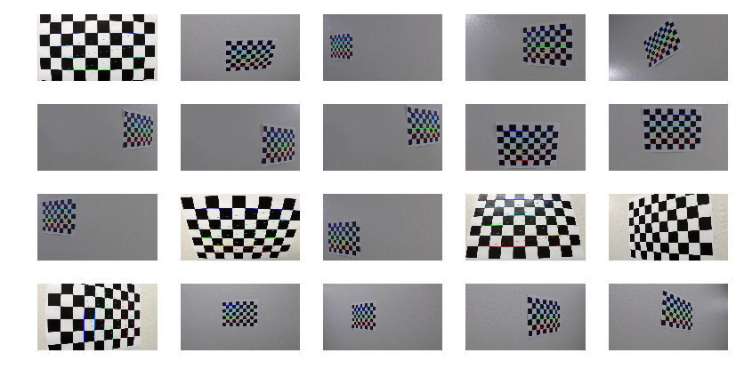
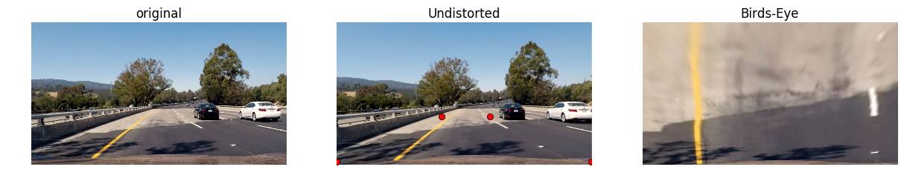
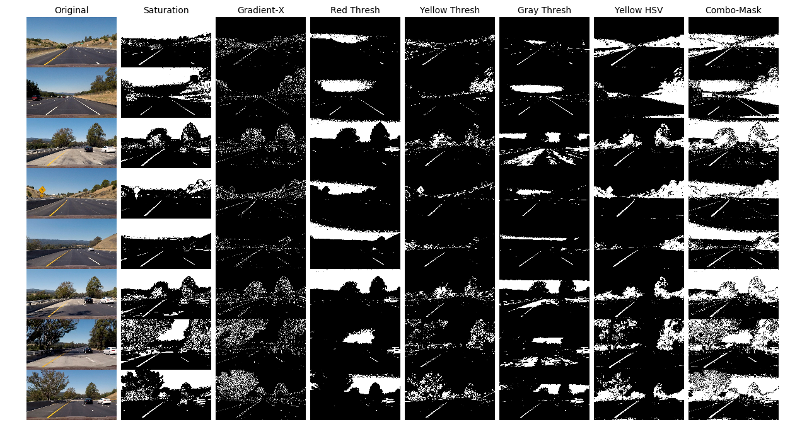
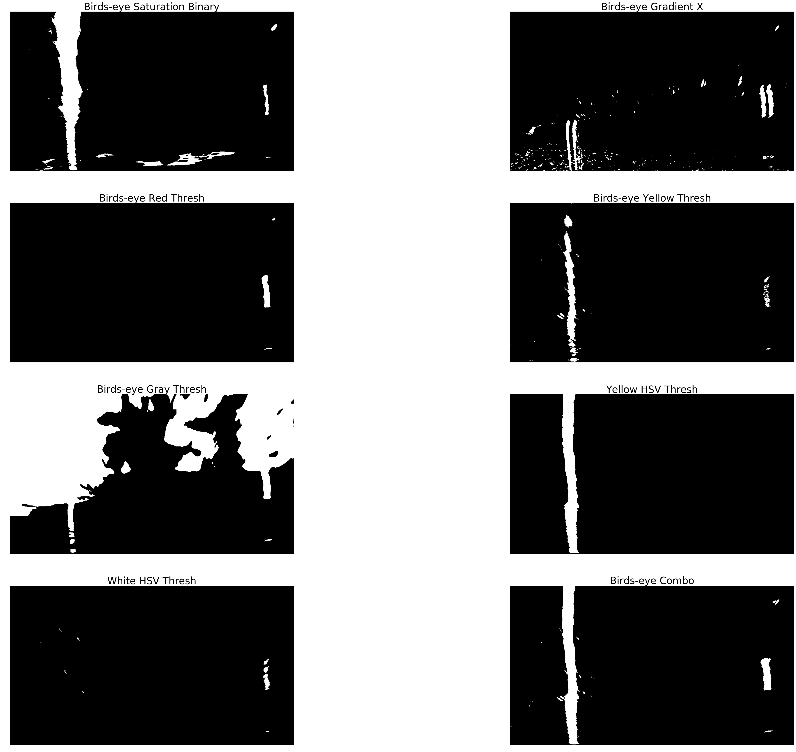
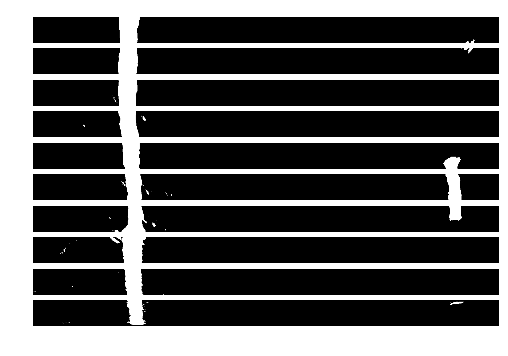
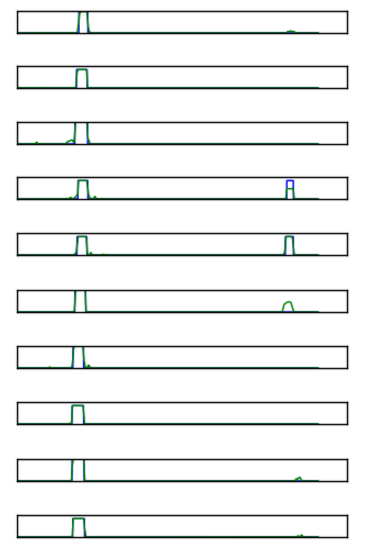
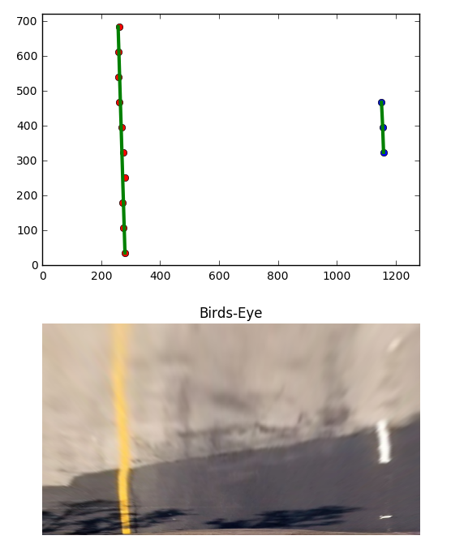
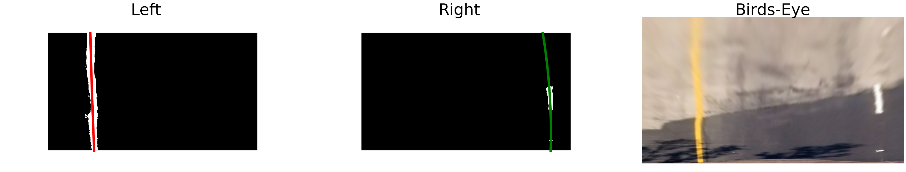
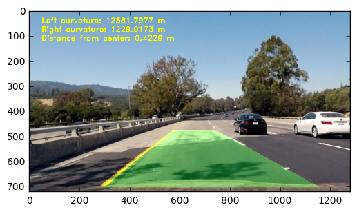

# Advanced Lane Finding

Author: Annie Flippo

Date: Jan-27-2017

This project is for Udacity Self-Driving Car Nanodegree, Project 4: Advanced Lane Finding 

# The Goal

In this project, my goal is to write a software pipeline to identify the lane boundaries in a video form a front-facing camera on a car.

## 1. Camera Calibration

First, I convert the provided chessboard images to grayscale.  Then, I use opencv's FindChessboardCorners( ) to find the inner corners of the chessboards. I noticed that because the chessboards images are taken in different angles sometimes there are different number of inner x and y corners.  I use a search method to find different number of inner x and y corners if I don't first find 9 inner x and 6 inner y corners.  This worked well and was able to find corners for most images except for one. 

Figure 1: Find Chessboard Corners


With all the found corners, I construct the camera calibration matrix, distortion coefficients, rotation vectors and translation vectors and undistort an image as follows.

```
ret, mtx, dist, rvecs, tvecs = cv2.calibrateCamera(objpoints, imgpoints, img_size, None, None)

undistort_img = cv2.undistort(img, mtx, dist, None, mtx)
```

Figure 2: Undistort Chessboard Image


My notebook **Camera-Calibration.ipynb** details all the steps is included.

## 2. Pipeline

### 2.1 Example of a Distorted-Corrected Image

First, I undistort images with the calibration matrices and vectors calculated in the previous step.  Here's an example of the original and undistorted image.

Figure 3: Original, Undistorted and Birds-eye Image


Notice the white car on the right in the undistorted image is a bit further back when compared to its position in the original image.

### 2.2 Color and Gradient Thresholding

This was the most time-consuming step for me.  It took a lot of trial and error to color threshold the yellow and white lane lines in combination of gradient thresholding in x-direction.  For color-thresholding, I sample the color using my Mac's Digital Color Meter for its RGB value.  I converted the RGB value to HSV using [RGB to HSV converter](http://www.rapidtables.com/convert/color/rgb-to-hsv.htm) so I can find the appropriate lowere and upper range for the hue and saturation.

For the six test images provided, I've tried my pipeline to find a good combination of thresholds so the lane lines are the most prominent.

Figure 4: Color and Gradient Thresholding


### 2.3 Birds-Eye Transformation

In masking the area properly so that an appropriate birds-eye view image can be instructed was challenging.  In the illustrated in Figure 3 above for the Undistorted image shows four red dots where I proportionally extracted from the size of the image then I use the ```warp_image()``` to get a birds-eye view image.

```
warped, M_warp, Minverse_warp = warp_image(img_undist, corner_src, corner_dst, (img_size[1], img_size[0]))
```

Additionally, I've used the birds-eye image to perform the various thresholding to verify that I'm extracting the best left and right lane lines.
Here the bottom right image is the total binary masking resultant image labeled as "Birds-eye Combo".


Figure 5: Birds-eye Image Thresholding


### 2.4 Identify Lane Line Pixels

I sub-divide the birds-eye image into ten segments.  I perform histograms on each segments to try to extract the area with the most signal. Here's a sample.

Figure 6: Segmented Binary Birds Eye Image



Figure 7: Detecting left and right lanes by segmenting the birds-eye image.


In each segment, I identify a representative (x,y) point pair by first dividing the image into a half: left half and right half.  I then try to find the mean of the images for all (x,y) pairs which are turned on in the masked binary image.  I pick out the mean (x,y) pair from the histogram with the largest signal.  In the included **Advanced-Lane-Finding.ipynb**, you'll see that I try with a higher threshold first where left_mean_lane > 0.5 and then progressive lower the threshold until left_mean_lane > 0.2.  I did this because sometimes the signal is weaker from dotted white lane lines.  This was the best way I've found by experimenting to extract the most lane signal even when it's weak.  I perform ```polyfit()``` on these representative (x,y) points for left and right lanes.  See below the representative (x,y) pair plot super-imposed with the fitted lines and its accompanying birds-eye view image.

Figure 8: Representative (x,y) pair plot super-imposed with its fitted line.


Figure 9: Combo Binary Mask with polynomial fitted line overlay.


### 2.5 Distance of the Car from Center of the Lane

This was a quick calculation to find difference between the pixel for the middle of the left and right lane and compare it with the middle of the image.  If the difference is positive then the car is leaning towards the right of the lane otherwise it's leaning towards the left of the lane.  With the given xm_per_pix = 3.7 meters/700 pixels, I've converted pixels to a meters distance for display.

### 2.6 Calculating Curvature of the Lane

With the (x,y) representative pairs found in earlier steps, I simply apply the formula below to calculate the curvature in meters where **_leftx_** are the left lane's x-values and **_yvals_** are the y-values of the left lane's (x,y) pairs from earlier.  Similarly, for the **_rightx_** are x-values and **_yvals_** are the y-values for the right lane's (x,y) pairs.

```
ym_per_pix = 30/720 # meters per pixel in y dimension
xm_per_pix = 3.7/700 # meteres per pixel in x dimension

left_fit_cr = np.polyfit(yvals*ym_per_pix, leftx*xm_per_pix, 2)
right_fit_cr = np.polyfit(yvals*ym_per_pix, rightx*xm_per_pix, 2)
left_curverad = ((1 + (2*left_fit_cr[0]*y_eval + left_fit_cr[1])**2)**1.5) \
                             /np.absolute(2*left_fit_cr[0])
right_curverad = ((1 + (2*right_fit_cr[0]*y_eval + right_fit_cr[1])**2)**1.5) \
                                /np.absolute(2*right_fit_cr[0])
```

### 2.7 Unwarp the Birds-Eye Image with Detected Lane Line

After finding the lane lines in the birds-eye image, I unwarp it back into original undistored dimension.

```
warp_zero = np.zeros_like(image_combo).astype(np.uint8)
color_warp = np.dstack((warp_zero, warp_zero, warp_zero))

# Recast the x and y points into usable format for cv2.fillPoly()
z_pts_left = np.array([np.transpose(np.vstack([left_fitx, left_y]))])
z_pts_right = np.array([np.flipud(np.transpose(np.vstack([right_fitx, right_y])))])
z_pts = np.hstack((z_pts_left, z_pts_right))

left_curve_m, right_curve_m = find_curvature(z_pts_left, z_pts_right)
cv2.fillPoly(color_warp, np.int_([z_pts]), (0,255,0))

# Warp the blank back to original image space using inverse perspective matrix (Minv)
newwarp = cv2.warpPerspective(color_warp, Minverse_warp, (width, height))
```

Figure 10: Final Image with Filled Detected Lane.



Please see final processed my YouTube [Advanced Lane Line Detection Project](https://youtu.be/_UCd7Sp9KUI) video.

## 3. Conclusion / Discussion

This was a very difficult project from the point of view that the thresholding can take many forms and many acceptable thresholds.  I had a very challenging time to mask correctly as gradient thresholding was very sensitive dark to shadows on the road.  

My pipeline seems to work with ideal lighting such as during daylight hours.  The yellow and white color masking seem to decrease in power when lighting is not good as in **curvy_mountain_challenge.mp4** video.  Another challenge was if there were any unexpected markings (e.g. the carpool diamond in **challenge_video.mp4**) on the road or if there was any debris (e.g. white plastic bags tumbling by).  My algorithm would pick up such objects and may include them into the lane line calculations. 

One improvement, as suggested in the class, was to create a short memory to the algorithm where I can store positions of lane line found in the last frame and use that to make an informed decision for the position of the lane lines in the next frame. 


